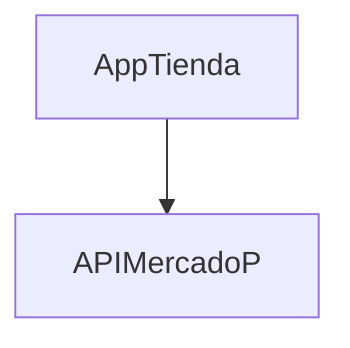
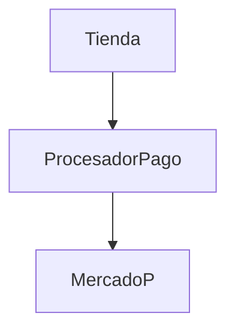
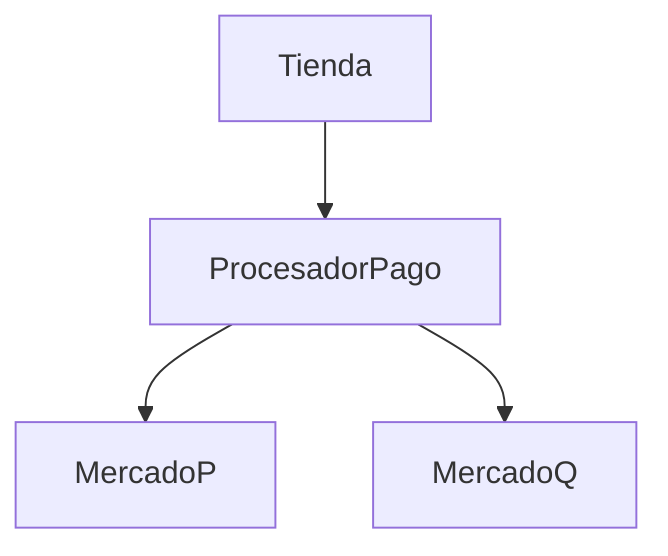

# Material Adicional - Principios SOLID

[Video sugerido por la Cátedra]<https://youtu.be/B5yxXWAO-1I>

## 1. El mundo real es complejo, pero el software también

Creamos software para resolver problemas del mundo real y el mundo real es complejo, está lleno de incertidumbre y gobernado por el azar.
Escribimos programas que nos permiten reducir el caos del mundo real creando modelos simplificados de esta complejidad.
Hay una variedad de técnicas que nos permiten alcanzar este objetivo, sin embargo, una de ellas es fundamental y la ponemos en práctica desde que comenzamos a escribir nuestros primeros programas. Ésta técnica es la _la descomposición funcional_ y consiste en descomponer un problema complejo en problemas más pequeños, y por ende más simples.
Sin embargo existen muchas formas de llevar a cabo esta descomposición y la forma en que se relacionan estas problemas más pequeños resultantes de la división nos enfrenta a un nuevo problema: ¿Cómo podemos saber si una alternativa es mejor, peor o similar a otra?
Hay dos métricas que nos dan idea acerca de cuán buena es una de estas alternativas: _acoplamiento_ y _cohesión_

## 2. Acoplamiento

El _acoplamiento_ nos da una idea de qué tan interdependientes son dos componentes. En este contexto, cuando hablamos de componentes nos referimos a: funciones, clases, módulos, etc.
Buscamos que los componentes tengan un bajo grado de acoplamiento.
El bajo acomplamiento hace que nuestros componentes sean más independientes, reutilizables, testeables y flexibles. Por otra parte, un alto grado de acoplamiento va a hacer que un cambio en un componente impacte en uno o más componentes relacionados y este impacto será mayor en la medida que el acoplamiento sea mayor.
En otras palabras un mayor grado de acoplamiento hará que nuestro programa sea menos mantenible y que su capacidad de ser reutilizable disminuya.

## 3. Cohesión

La _cohesión_ es la medida en que los elementos de un mismo componente están relacionados entre sí formando un elemento mayor con un propósito específico.
Una alta cohesión nos permite que nuestro software sea más reutilizable, ya que toda la funcionalidad relacionada está concentrada en un componente; más coherente porque todos los elementos en un componente tienen que ver con el mismo tema o abstracción; más testeable ya que nos permite testearlo como una caja negra.
Buscamos entonces que la cohesión entre los elementos de un componente sea alta.

Un buen diseño busca minimizar el _acoplamiento_ y maximizar la _cohesión_


## 4. SOLID

Existen una serie de técnicas y principios, muchas veces complementarios, que nos permiten lograr el objetivo de minimizar el acoplamiento y maximizar la cohesión y, en resumen, escribir software más mantenible: _SOLID_, _YAGNI_ (You Arent Gonna Need It - No vas a necesitarlo), _KISS_ (Keep It Simple Stupid) y _DRY_ (Don't Repeat Yourself) son algunos de ellos.
Los principios _SOLID_ fueron enunciados por [Robert C. Martin (Uncle Bob)](https://es.wikipedia.org/wiki/Robert_C._Martin) y mediante su aplicación podemos conseguir que nuestro software sea más entendible, mantenible y flexible.
_SOLID_ es un acrónimo que nos sirve como regla mnemotécnica para recordar estos cinco principios:

-   _S_ - Single Responsability: Principio de Responsabilidad Única.
-   _O_ - Open-Closed: Principio Abierto-Cerrado.
-   _L_ - Liskov Substitution: Principio de Substitución de Liskov.
-   _I_ - Interface Segregation: Segregación de Interfaces
-   _D_ - Dependency Inversion: Inversión de Dependencias


Vamos a ver cada uno de ellos en detalle y mediante ejemplos.

### 4.1. (**S**)ingle Responsability: Principio de Responsabilidad Única

_Una clase o función debe tener una, y solamente una, razón para cambiar._
El problema con este principio es que, debido a su nombre, muchas veces se entiende como que el módulo debe hacer sólo una cosa y no es éste el proósito del principio.
Mediante la aplicación de este principio se incrementa la cohesión, como se puede ver en el ejemplo. En general, la aplicación de este principio hará que aumente la cantidad de módulos de nuestro programa.

** Ejemplo **
Esta clase `ControladorGastos`, cuyo fin es llevar un control de gastos contra un monto que se fija como presupuesto, tiene dos propiedades que mantienen el gasto que se ha efectuado y el presupuesto estipulado.

index.js

```javascript
class ControladorGastos {
    constructor(presupuesto) {
        this.presupuesto = presupuesto;
        this.gastos = 0.0;
    }

    registrarGasto(gasto) {
        this.gastos += gasto;

        if (this.gastos > this.presupuesto) {
            this.logExcesoPresupuesto();
        }
    }

    logExcesoPresupuesto() {
        console.log("¡Se ha excedido el presupuesto!");
    }
}

const controladorGastos = new ControladorGastos(5000);
controladorGastos.registrarGasto(1000);
controladorGastos.registrarGasto(2000);
controladorGastos.registrarGasto(4000);
controladorGastos.registrarGasto(2000);
```

Podemos identificar más de una razón para que ésta clase cambie: si, cambia la lógica en función de la cual determinamos que el presupuesto se ha excedido, por ejemplo, incorporando otro criterio como la cantidad de gastos, tendremos que cambiar la clase. También lo tendremos que hacer si, digamos, cambia la forma en que se desea informar que el presupuesto se ha excedido, supongamos que deseamos escribir este mensaje en un archivo o enviarlo por mail.

Aplicando el principio de responsabilidad única podemos extraer la lógica del mensaje en otra clase que llamaremos `Logger`

index.js

```javascript
import Logger from "./logger.js";

class ControladorGastos {
    constructor(presupuesto) {
        this.presupuesto = presupuesto;
        this.gastos = 0.0;
    }

    registrarGasto(gasto) {
        this.gastos += gasto;

        if (this.gastos > this.presupuesto) {
            this.logExcesoPresupuesto();
        }
    }

    logExcesoPresupuesto() {
        Logger.log("¡Se ha excedido el presupuesto!");
    }
}

const controladorGastos = new ControladorGastos(5000);
controladorGastos.registrarGasto(1000);
controladorGastos.registrarGasto(2000);
controladorGastos.registrarGasto(4000);
controladorGastos.registrarGasto(2000);
```

logger.js

```javascript
export default class Logger {
    static log(mensaje) {
        console.log(mensaje);
    }
}
```

Ahora podríamos reimplementar el método `Logger.log()` y hacer que envíe un email o que guarde los mensajes en un archivo secuencial.

### 4.2. (**O**)pen/Closed: Principio Abierto/Cerrado

_Una clase o función debe estar abierta para su extensión pero cerrada para su modificación._
Es decir que deberíamos poder extender el funcionamiento de una clase o módulo pero sin modificar su implementación, es decir, su código fuente. En otras palabras, no deberías tener que modificar el código de la clase o módulo para modificar su comportamiento, sino solo agregar código. Este principio está muy relacionado con el principio de responsabilidad única.

** Ejemplo **
En este ejemplo tenemos una función que imprime un formulario. El formulario contiene distintos tipos de preguntas (booleano, opcionMultiple, texto, rango)
El uso de una instrucción `switch` ya presupone una violación al principio de abierto o cerrado, ya que agregar otro tipo de pregunta, por ejemplo: numérica, implica que tengamos que cambiar el código de la función. Tendríamos que agregar un caso más a la instrucción switch que irá creciendo en tamaño dificultad para ser legible.

index.js

```javascript
function imprimirCuestionario(preguntas) {
    preguntas.forEach((pregunta) => {
        console.log(pregunta.texto);

        switch (pregunta.tipo) {
            case "booleano":
                console.log("1. Si");
                console.log("2. No");
                break;

            case "opcionMultiple":
                pregunta.opciones.forEach((opcion, index) => {
                    console.log(`${index + 1}. ${opcion}`);
                });
                break;

            case "texto":
                console.log("Respuesta: ____________________");
                break;

            case "rango":
                console.log("Desde: ___________________");
                console.log("Hasta: ___________________");
                break;
        }

        console.log("");
    });
}

const preguntas = [
    {
        tipo: "booleano",
        texto: "¿Es alumno regular?",
    },
    {
        tipo: "opcionMultiple",
        texto: "¿Cuál es su lenguaje preferido?",
        opciones: ["C#", "SQL", "Javascript", "Python"],
    },
    {
        tipo: "texto",
        texto: "Mencione la característica preferida del lenguaje seleccionado:",
    },
    {
        tipo: "rango",
        texto: "Lapso de tiempo en el que trabajó en su lenguaje preferido.",
    },
];

imprimirCuestionario(preguntas);
```

Veamos cómo implementar una alternativa que aplique el principio de abierto cerrado: creamos una clase para cada tipo de pregunta. La función `imprimirCuestionario()` se limita simplemente a recorrer las preguntas e imprimir el texto y el detalle.
Si quisieramos agregar un nuevo tipo de pregunta, solo tenemos que agregar una clase que "conozca" este nuevo tipo y agregar la(s) pregunta(s) al arreglo `preguntas`, no tenemos necesidad de cambiar la función `imprimirCuestionario()`

index.js

```javascript
import PreguntaBooleana from "./preguntaBooleana.js";
import PreguntaMultipleOpcion from "./preguntaMultipleOpcion.js";
import PreguntaTexto from "./preguntaTexto.js";
import PreguntaRango from "./preguntaRango.js";

function imprimirCuestionario(preguntas) {
    preguntas.forEach((pregunta) => {
        console.log(pregunta.texto);
        pregunta.ImprimirDetallePregunta();
        console.log("");
    });
}

const preguntas = [
    new PreguntaBooleana("¿Es alumno regular?"),
    new PreguntaMultipleOpcion("¿Cuál es su lenguaje preferido?", [
        "C#",
        "SQL",
        "Javascript",
        "Python",
    ]),
    new PreguntaTexto(
        "Mencione la característica preferida del lenguaje seleccionado:"
    ),
    new PreguntaRango(
        "Lapso de tiempo en el que trabajó en su lenguaje preferido."
    ),
];

imprimirCuestionario(preguntas);
```

preguntaBooleana.js

```javascript
export default class PreguntaBooleana {
    constructor(texto) {
        this.texto = texto;
    }

    ImprimirDetallePregunta() {
        console.log("1. Si");
        console.log("2. No");
    }
}
```

preguntaMultipleOpcion.js

```javascript
export default class PreguntaMultipleOpcion {
    constructor(texto, opciones) {
        this.texto = texto;
        this.opciones = opciones;
    }

    ImprimirDetallePregunta() {
        this.opciones.forEach((opcion, index) => {
            console.log(`${index + 1}. ${opcion}`);
        });
    }
}
```

preguntaTexto.js

```javascript
export default class PreguntaTexto {
    constructor(texto) {
        this.texto = texto;
    }

    ImprimirDetallePregunta() {
        console.log("Respuesta: ____________________");
    }
}
```

preguntaRango.js

```javascript
export default class PreguntaRango {
    constructor(texto) {
        this.texto = texto;
    }

    ImprimirDetallePregunta() {
        console.log("Desde: ___________________");
        console.log("Hasta: ___________________");
    }
}
```

### 4.3. (**L**)iskov Substitution: Principio de Substitución de Liskov

_En un programa compuesto por distintas clases o módulos, estos pueden ser remplazados por subclases o módulos de comportamiento compatible sin alterar el funcionamiento del programa._


### 4.4. (**I**)nterface Segregation: Segregación de Interfaces

_Los clientes no deben ser forzados a depender de los métodos que no utilizan._

### 4.5. (**D**)ependency Inversion: Inversión de Dependencias

_- Los módulos de alto nivel no deberían depender de los módulos de bajo nivel. Ambos deberían depender de abstracciones ( p.ej., interfaces)._
_- Las abstracciones no deberían depender de los detalles. Los detalles (implementaciones concretas) deben depender de abstracciones._

El objetivo principal de la aplicación de este principio es reducir el acoplamiento.

Supongamos que desarrollamos una aplicación de comercio electrónico que para procesar los pagos depende de un tercero como MercadoPago o Paypal. Cada una de estas tiene una API específica. Para evitar las referencias a compañías concretas vamos a llamar _MercadoP_ a la empresa de pagos que utiliza nuestra aplicación de comercio electrónico.



Si hacemos esto, vamos a tener una serie de referencias concretas a la API de MercadoP en nuestro código. Si en el futuro esta API cambia, o decidimos incorporar a _MercadoQ_ como alternativa para el pago, vamos a necesitar hacer cambios en gran parte de nuestro código poder admitir ambas alternativas. ¿Y si se agrega una tercera...? Otra vez lo mismo.

Dependiendo del medio de pago que se utilice vamos a necesitar referencias concretas a una u otra alternativa.

index.js
```javascript
import TiendaMercadoP from "./tiendaMercadoP.js";
import TiendaMercadoQ from "./tiendaMercadoQ.js";

// Tienda con pagos por MercadoP
const tiendaMercadoP = new TiendaMercadoP("Juan Perez");
tiendaMercadoP.comprar("heladera", 3);
tiendaMercadoP.comprar("cocina", 2);

// Tienda con pagos por MercadoQ
const tiendaMercadoQ = new TiendaMercadoQ("Maria Manzo");
tiendaMercadoQ.comprar("heladera", 3);
tiendaMercadoQ.comprar("cocina", 2);
```

Si agregamos algo en el medio podemos abstraer las dependencias:


Entonces, si agregamos una segunda alternativa para gestionar los pagos



Ahora para procesar los pagos por un operador distinto, solo le pasamos una instancia de ese procesador a nuestra clase Tienda.
No queremos que nuestra Tienda dependa directamente de cómo funcionan *MercadoP* (o *MercadoQ*) sino de una abstracción.  

index.js
```javascript
import Tienda from "./tienda.js";
import ProcesadorPagoMercadoP from "./procesadorPagoMercadoP.js";
import ProcesadorPagoMercadoQ from "./procesadorPagoMercadoQ.js";

let procesadorPago = new ProcesadorPagoMercadoP("Juan Perez");
let tienda = new Tienda(procesadorPago);
tienda.comprar("heladera", 3);
tienda.comprar("cocina", 2);

// Para cambiar de procesador solamente le pasamos otro procesador a la tienda
procesadorPago = new ProcesadorPagoMercadoQ("Maria Manzo");
tienda = new Tienda(procesadorPago);
tienda.comprar("heladera", 3);
tienda.comprar("cocina", 2);
```
tienda.js
```javascript
export default class Tienda {
    constructor(procesadorPago) {
        this.procesadorPago = procesadorPago;
        this.precios = { heladera: 140000, cocina: 90000 };
    }

    comprar(producto, cantidad) {
        this.procesadorPago.pagar(this.precios[producto] * cantidad);
    }
}
```
